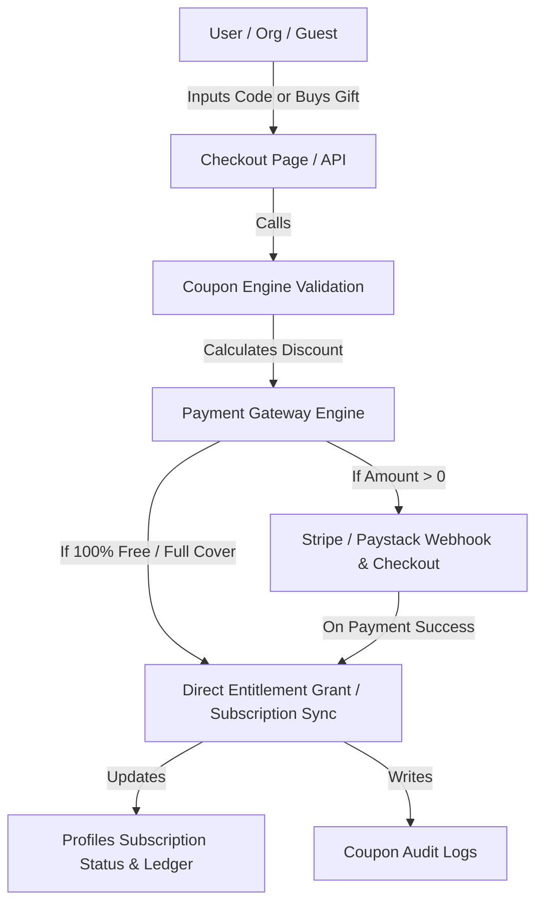
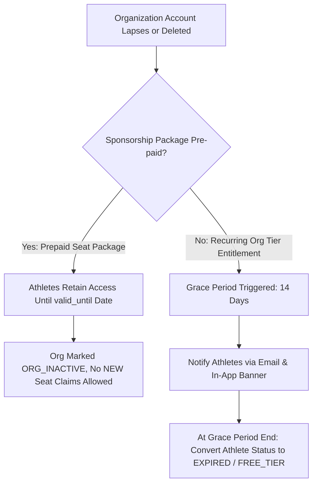
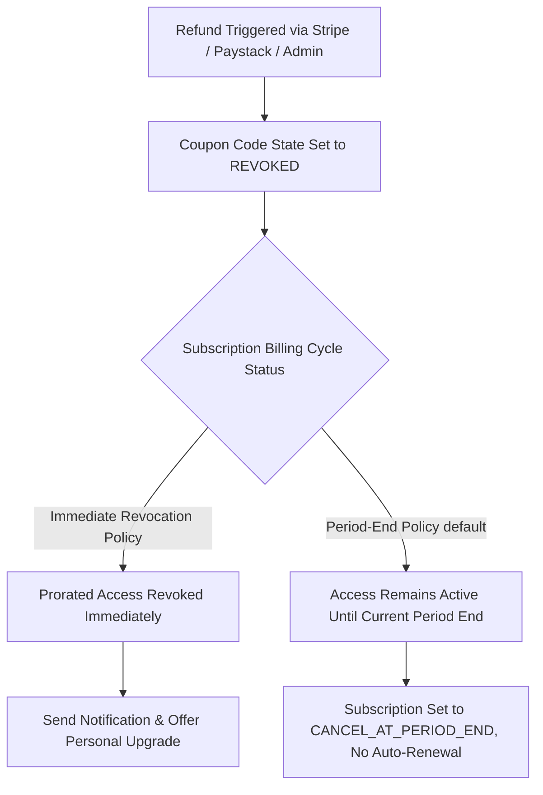
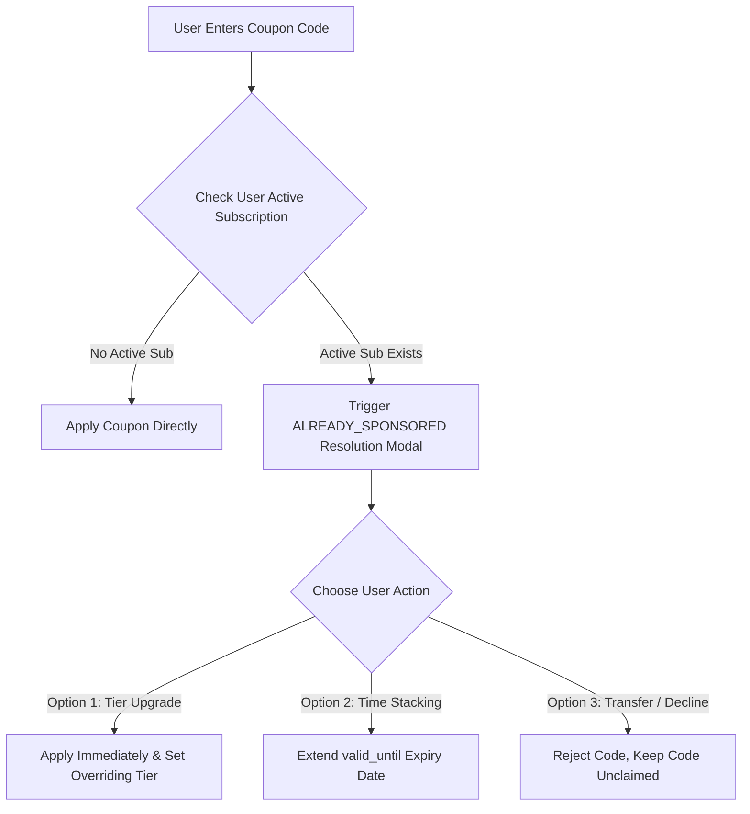
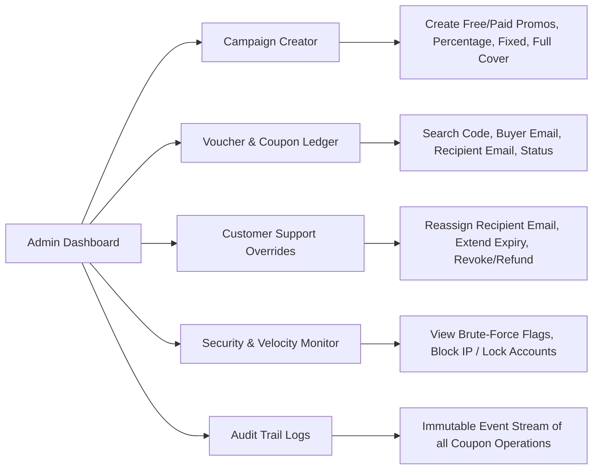

# Comprehensive Implementation Plan: CenterKick Coupon & Sponsorship System

**Branch:** `feature/coupons`  
**Status:** In Planning & Architecture Phase  
**Last Updated:** August 22, 2026  

---

## 1. System Integration Architecture: Subscriptions & Payment Gateway Integration

To prevent fragmentation, the Coupon Engine integrates directly into **CenterKick's Subscription System** and **Payment Gateway Engine**.



### Key Integration Points:
1. **Subscription Engine Sync**:
   - **Subscription Statuses:** `ACTIVE`, `SPONSORED`, `GIFT_COVERED`, `TRIALING`, `EXPIRED`, `CANCELLED`.
   - **Role Entitlements:** Upon successful coupon redemption, the user profile is tagged with `subscription_tier`, `sponsor_id` (if Org-sponsored), and `valid_until` timestamp.
   - **Renewal Handling:** When a coupon provides a discount (e.g., 20% off or 3 months free), the subscription billing cycle updates accordingly. Upon expiration, the subscription converts to standard recurring billing unless canceled.
2. **Payment Gateway Engine Sync (Stripe / Paystack)**:
   - **Multi-Currency Support:** Fully aligned with CenterKick's `CURRENCIES` utility (`EUR`, `USD`, `GBP`, `NGN`).
   - **Zero-Dollar Checkout (100% Discount / Free Trial):** Bypasses payment gateway API calls safely, preventing unnecessary transaction fees while directly generating subscription records and audit trails.
   - **Partial Discounts (Fixed / Percentage):** Creates a Stripe/Paystack Checkout Session with applied `discounts` / line item adjustments based on verified coupon calculations.

---

## 2. Deep-Dive Edge Case Mechanics & Lifecycle Protocols

To ensure business continuity, legal compliance, and a smooth user experience, we explicitly define the mechanics for critical edge cases:

### A. Sponsoring Organization Account Lapse or Deletion

When an Organization's account lapses (due to failed subscription payment) or is soft-deleted by an Admin:



1. **Prepaid Seat Packages (Fully Paid Upfront):**
   - **Policy:** **Irrevocable Athlete Access.** If an Organization prepaid for 50 annual player seats, those players **retain their access until the package expiration timestamp (`valid_until`)**, regardless of whether the Org's own account lapses or is deleted later.
   - **Org Status Lock:** The Organization's coupon package state toggles to `ORG_INACTIVE`. Existing redeemed players continue their plan uninterrupted, but **no NEW unredeemed codes can be claimed**.
2. **Recurring / Entitlement-Bound Sponsorships:**
   - **Grace Period (14 Days):** If the Org's access lapses, sponsored players receive an in-app banner and automated email notification: *"Your sponsored access from [Org Name] is ending in 14 days. Add a personal payment method to maintain uninterrupted access."*
   - **Grace Period Expiration:** At Day 14, the player's `sponsor_id` tag is cleared, `subscription_status` transitions to `EXPIRED`, and their access reverts safely to the base free tier without data loss.

---

### B. Mid-Cycle Refund & Revocation Protocol

When a sponsor or purchaser requests a refund mid-way through an active subscription billing cycle:



1. **Immediate Revocation (Chargeback / Fraud / Dispute):**
   - If a payment is disputed or flagged as fraudulent, access is revoked **immediately**.
   - DB Trigger: `coupon_codes.status` set to `REVOKED`. `profiles.subscription_status` set to `EXPIRED`.
   - Redeemer UI: User receives an immediate notification explaining that their sponsorship voucher was invalidated due to a payment dispute, with a 1-click option to switch to a self-paid plan.
2. **Prorated / Voluntary Refund (Customer Support / Admin Override):**
   - If an Admin grants a partial/full refund voluntarily, the default policy is **`CANCEL_AT_PERIOD_END`**.
   - The athlete retains access for the remaining days of the current prepaid month/cycle, but the subscription will **not auto-renew**.
   - The Org's `remaining_seats` count is **not** restored if the seat was already partially used.

---

### C. `ALREADY_SPONSORED` Resolution & Tier Upgrade Mechanics

If a user who already has an active sponsorship (e.g. 1-Year Standard Player Sponsorship from Org A) attempts to redeem another coupon code (e.g. 1-Year Premium Coach Sponsorship from Org B or a 20% Promo Code):



#### The `ALREADY_SPONSORED` Interactive Modal Options:
Instead of a cold error block, the system presents an interactive modal with 3 choices:

1. **Higher Tier Upgrade (e.g., Standard Player -> Premium Elite):**
   - **Action:** Upgrades the user's tier immediately.
   - **Time Balance Adjustment:** The new code takes effect today. If the new code is from a different sponsor, `sponsor_id` updates to the new Org. The old sponsor's seat is relinquished/released back to Org A's pool if less than 7 days have passed, otherwise it remains consumed.
2. **Same-Tier Time Stacking (e.g., 1-Year Standard -> +1-Year Standard):**
   - **Action:** If the new code is for the *same tier*, the system **stacks the duration**.
   - **Result:** `valid_until` date is extended by the new code's duration (e.g. `2026-12-31` extended to `2027-12-31`).
3. **Decline / Keep Code Unclaimed:**
   - **Action:** The code remains `AVAILABLE` in the code ledger and is **not redeemed**, allowing the user to give it to a teammate or save it for later.

---

## 3. Granular User Activities & State Matrix

### A. Organization User Account (Bulk Sponsorship Issuer)

| Step / Action | Inputs / Controls | Expected Output / Result | Possible Error Cases & Handlers | Active & Inactive States |
| :--- | :--- | :--- | :--- | :--- |
| **1. Create Sponsorship Package** | Package Title, Seat Count, Plan Tier, Code Type (`Batch Unique` vs `Single Shared Group`). | Calculated total cost based on seat volume and multi-seat discount. | `INVALID_SEAT_COUNT` (Seats < 1), `UNSUPPORTED_CURRENCY`. | **Draft / Pending Payment** until checkout completes. |
| **2. Purchase Package** | Payment Gateway Details (Credit Card / Local Transfer). | Order confirmation, package activation, and generation of `N` unique codes or 1 group code with max cap = `N`. | `PAYMENT_FAILED`, `INSUFFICIENT_FUNDS`. | Transitions package state to **ACTIVE**. |
| **3. Seat Allocation & Roster Tracking** | View seat roster dashboard, view claimed vs remaining seats, enter athlete emails for direct invites. | Live progress bar (e.g., "12/50 Seats Claimed"), automated invite emails sent with 1-click claim URLs. | `DUPLICATE_INVITE_EMAIL` (warning displayed), `OUT_OF_SEATS` (block invite input). | Code state: **AVAILABLE**, **REDEEMED**, or **REVOKED**. |
| **4. Export Invitation Data** | Click "Download CSV" button. | Auto-generated CSV file containing: `Code`, `Direct Claim Link`, `Status`, `Redeemer Email`, `Claimed At`. | `NO_CODES_FOUND`. | Available anytime package is **ACTIVE**. |
| **5. Resend / Revoke Invitation** | Click "Resend Email" or "Revoke Code" on unredeemed seats. | Invite email dispatched again, OR code state toggles to `REVOKED` and seat count restores. | `CODE_ALREADY_REDEEMED` (Revocation blocked with error toast). | Code state toggles between **AVAILABLE** and **REVOKED**. |

---

### B. Public Frontend Gifters (Non-Signed-Up / Guest Users)

| Step / Action | Inputs / Controls | Expected Output / Result | Possible Error Cases & Handlers | Active & Inactive States |
| :--- | :--- | :--- | :--- | :--- |
| **1. Configure Gift Voucher** | Select Subscription Tier / Duration, Buyer Name & Email, Recipient Email (optional), Custom Message. | Voucher summary display showing currency cost and delivery choice. | `INVALID_EMAIL_FORMAT`, `EMPTY_BUYER_EMAIL`. | State: **UNPAID_GIFT**. |
| **2. Guest Checkout** | Payment Card / Local Payment input via Gateway. | Order success screen showing unique Gift Voucher code (`CK-GIFT-XXXX`), order confirmation email sent to buyer. | `PAYMENT_DECLINED`, `TIMEOUT`. | Toggles status to **UNCLAIMED_GIFT**. |
| **3. Automated / Manual Delivery** | Toggle "Send via Email" vs "I will deliver manually". | If email selected: Recipient gets styled gift email with custom note and claim link. If manual: Buyer gets raw code to copy/print. | `EMAIL_BOUNCED` (Flagged in admin ledger for reassignment). | Voucher status: **UNCLAIMED** -> **REDEEMED**. |
| **4. Order Tracking Link** | Click tracking link in confirmation email. | Order Status Page showing whether recipient has claimed the voucher yet (`Unclaimed` vs `Redeemed on [Date]`). | `INVALID_TRACKING_TOKEN`. | Active until voucher is **REDEEMED** or **EXPIRED**. |

---

### C. End-Users / Redeemers (Players, Coaches, Scouts)

| Step / Action | Inputs / Controls | Expected Output / Result | Possible Error Cases & Handlers | Active & Inactive States |
| :--- | :--- | :--- | :--- | :--- |
| **1. Registration / Checkout Code Entry** | Enter code string into "Have a Promo / Sponsorship Code?" field on `/register` or `/checkout`. | Real-time validation badge: "✓ 100% Sponsored by [Org Name]" or "✓ 20% Off Applied". Recalculates total price dynamically. | `INVALID_CODE`, `EXPIRED_CODE`, `REACHED_MAX_REDEMPTIONS`, `REVOKED_CODE`, `RATE_LIMITED` (too many guesses). | Code state checked dynamically. |
| **2. Active Sub Resolution** | System detects user already has an active subscription. | Interactive Upgrade/Stacking Modal appears ("Upgrade Tier", "Stack Time", or "Keep Unclaimed"). | `INCOMPATIBLE_TIER` (Attempting downgrade blocked). | Modal state: User resolves choice without losing code. |
| **3. Finalize Subscription / Claim** | Click "Complete Registration" or "Confirm Subscription". | Account created/upgraded, subscription active immediately. Audit log entry written. | `DB_TRANSACTION_FAILURE`. | User subscription set to **ACTIVE (SPONSORED/GIFT)**. |
| **4. Account Settings Display** | View "My Subscription" tab in profile settings. | Display banner: "Plan active via Organization Sponsorship ([Org Name]) - Valid until [Date]". | None. | Displays active sponsorship status clearly. |

---

## 4. CenterKick Admin Dashboard & Moderation Management Hub (`/admin/coupons`)

### Admin Controls & Capabilities Matrix:



#### Detailed Admin Features:
1. **Campaign Creator & Rule Configuration**:
   - **Coupon Types:** Free (SuperAdmin only), Percentage Off, Fixed Amount Off, Free Trial Months.
   - **Restrictions:** Start/End timestamps, Global max redemptions, Target user roles (`Player`, `Coach`, `Scout`), Currency lock.
2. **Master Voucher Ledger**:
   - Filter by: Issuer Type (`Admin`, `Org`, `Public Gift`), Status (`Available`, `Redeemed`, `Revoked`, `Expired`), Date range.
   - Instant search by: Code string, Buyer Email, Recipient Email, Payment Transaction Reference.
3. **Customer Support Overrides**:
   - **Typo Fix / Reassignment:** If a guest gifter misspells recipient email (`gmaill.com`), Admin can update the recipient email on unredeemed vouchers.
   - **Expiration Extension:** Extend validity by `N` days for customer resolution.
   - **Refund Invalidation:** Single-click manual revocation, or automated trigger via Stripe/Paystack refund webhooks (with choices for Immediate vs. End-of-Period cancel).
4. **Velocity & Anti-Abuse Monitoring**:
   - Live security feed showing IP addresses hitting >5 failed code validations within 15 minutes.
   - One-click temporary IP block or CAPTCHA enforcement flag.
5. **System Audit Logs**:
   - Immutable audit trail capturing: `Actor ID`, `Action` (`CREATED`, `REDEEMED`, `REVOKED`, `EXTENDED`, `REASSIGNED`), `Timestamp`, `Metadata Snapshot`.

---

## 5. Scalability, Security & Maintainability Optimization Strategies

To ensure the Coupon System scales smoothly to thousands of concurrent users during major campaigns:

### 1. Database & Transaction Concurrency (Zero Over-Subscribing)
- **Atomic PostgreSQL Function (`redeem_coupon_code`)**:
  Using `SELECT ... FOR UPDATE` row locks inside PostgreSQL functions guarantees that under heavy concurrent load, a coupon with 1 remaining seat is redeemed **exactly once**, preventing race conditions.

```sql
-- Atomic DB Function Draft with Stacking & Upgrade Support
CREATE OR REPLACE FUNCTION redeem_coupon_code(
  p_code TEXT,
  p_user_id UUID,
  p_user_email TEXT,
  p_resolution_mode TEXT DEFAULT 'DEFAULT' -- 'UPGRADE', 'STACK', or 'DEFAULT'
) RETURNS JSONB AS $$
DECLARE
  v_code_rec RECORD;
  v_coupon_rec RECORD;
BEGIN
  -- Lock code row for concurrent safety
  SELECT * INTO v_code_rec FROM coupon_codes 
  WHERE UPPER(code) = UPPER(p_code) FOR UPDATE;

  IF NOT FOUND THEN
    RETURN jsonb_build_object('success', false, 'error', 'INVALID_CODE');
  END IF;

  IF v_code_rec.status != 'AVAILABLE' THEN
    RETURN jsonb_build_object('success', false, 'error', 'CODE_UNAVAILABLE');
  END IF;

  IF v_code_rec.expiry_date IS NOT NULL AND v_code_rec.expiry_date < NOW() THEN
    UPDATE coupon_codes SET status = 'EXPIRED' WHERE id = v_code_rec.id;
    RETURN jsonb_build_object('success', false, 'error', 'CODE_EXPIRED');
  END IF;

  IF v_code_rec.redemption_count >= v_code_rec.max_redemptions THEN
    RETURN jsonb_build_object('success', false, 'error', 'MAX_REDEMPTIONS_REACHED');
  END IF;

  -- Increment counters and record redemption atomically
  UPDATE coupon_codes 
  SET redemption_count = redemption_count + 1,
      status = CASE WHEN redemption_count + 1 >= max_redemptions THEN 'REDEEMED' ELSE 'AVAILABLE' END
  WHERE id = v_code_rec.id;

  INSERT INTO coupon_redemptions (coupon_code_id, redeemer_id, redeemer_email, redeemed_at)
  VALUES (v_code_rec.id, p_user_id, p_user_email, NOW());

  RETURN jsonb_build_object('success', true, 'code_id', v_code_rec.id);
END;
$$ LANGUAGE plpgsql SECURITY DEFINER;
```

### 2. High-Entropy Code Generation
- Codes use base-32 alphanumeric character sets (excluding confusing characters like `0/O`, `1/I`) formatted as `CK-XXXX-XXXX` providing **>33 million combinations per segment**, rendering automated brute-forcing mathematically infeasible.

### 3. Rate-Limiting Shield (Anti-Brute Force)
- Memory-cached or DB-backed sliding window rate limiter tracking validation requests per IP / Session ID.
- Exceeding 5 failures per 15 minutes triggers a mandatory CAPTCHA or 15-minute temporary lockout.

### 4. Indexing & Query Performance
- Database indexes created on:
  - `coupon_codes(UPPER(code))` -> Fast $O(1)$ lookups.
  - `coupon_codes(recipient_email, buyer_email)` -> Instant admin searches.
  - `coupon_redemptions(redeemer_id)` -> Fast subscription check on user login.

---

## 6. Phased Roadmap Summary

- **Phase 1: DB Schema & Atomic Engine** (PostgreSQL Functions, Migrations, Server Actions).
- **Phase 2: Redeemer Flow & Payment Gateway Sync** (Checkout component, zero-dollar bypass, Stripe/Paystack webhook updates, Upgrade/Stacking Modal).
- **Phase 3: Organization Sponsorship Dashboard** (Bulk purchasing, seat roster, CSV download, invitation emails, Org lapse protocols).
- **Phase 4: Public Frontend Gifting** (`/gift` route, guest checkout, buyer/recipient email dispatches).
- **Phase 5: Admin Moderation Hub (`/admin/coupons`)** (Campaign creation, ledger, reassignment/overrides, refund revocation triggers, security velocity logs).

---

---

*Maintained at `docs/COUPON_SYSTEM_IMPLEMENTATION_PLAN.md` and detailed user flow guide at `docs/COUPON_USER_FLOW_AND_ACTIVITY.md` on branch `feature/coupons`.*
