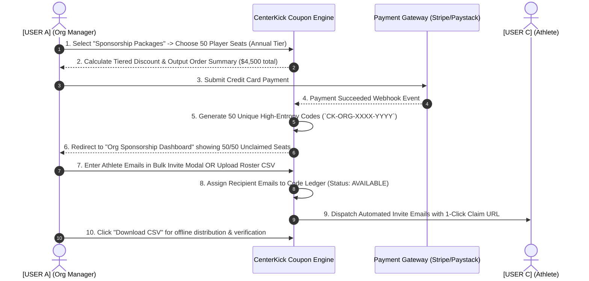
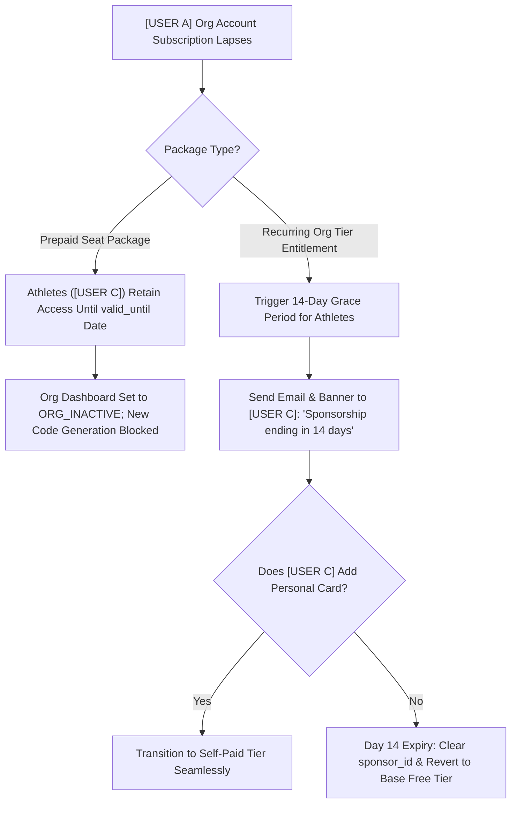
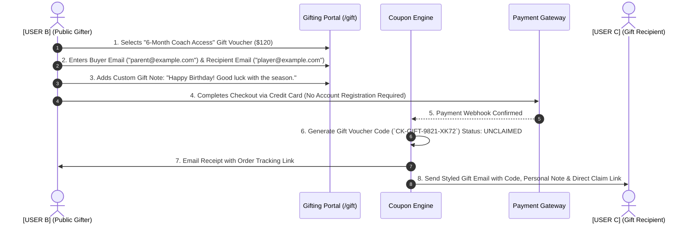
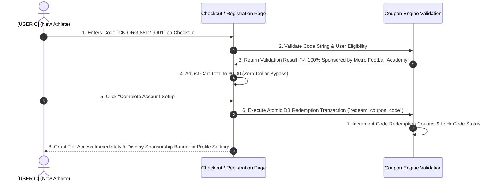
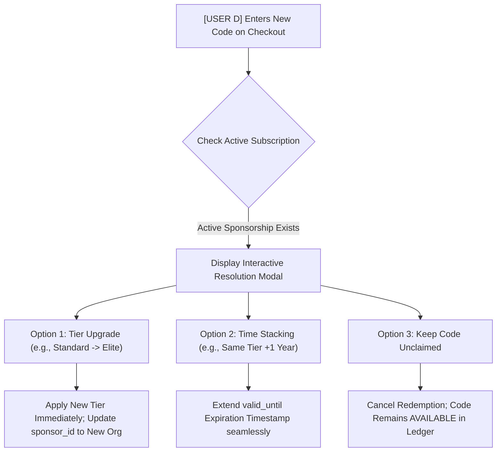
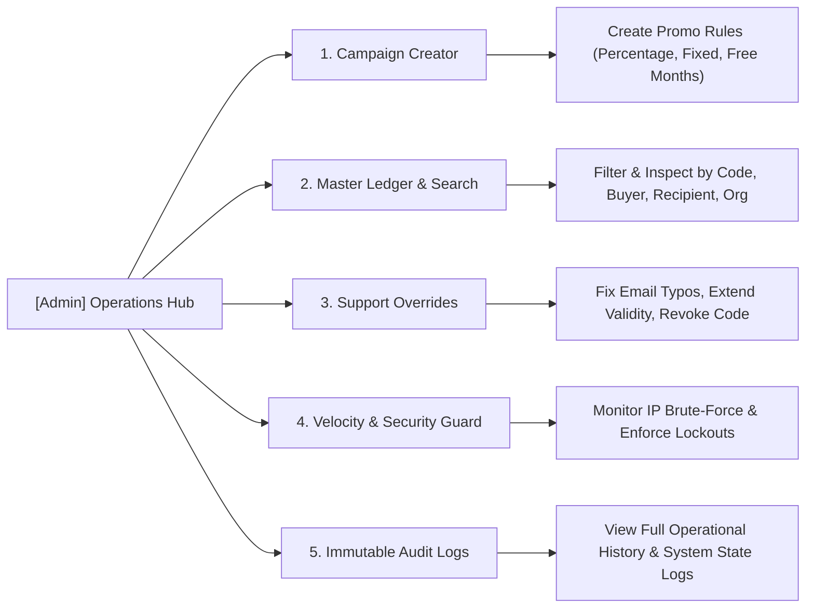

# User Flow & Activity Guide: CenterKick Coupon & Sponsorship System

**Document Version:** 1.0  
**Target Architecture:** CenterKick Platform (`feature/coupons`)  
**Purpose:** Detailed step-by-step user activity flows across all account types (Organization, Public Gifters, Redeemers, and Admins) to illustrate system interactions, edge-case mechanics, and moderation activities.

---

## 1. Actor Tag Key & Persona Overview

To keep interactions clear and structured, the following tags represent each user role and entity:

*   **`[USER A]` - Organization Sponsor Account Manager:** (e.g., Academy Director, Club Manager, Team Coordinator) buying and managing bulk athlete sponsorships.
*   **`[USER B]` - Public Gifter (Guest / Non-Registered User):** A parent, agent, fan, or relative buying a single gift voucher from the public site.
*   **`[USER C]` - Target Redeemer (Athlete / Coach / Scout):** The end recipient registering or updating their subscription using a coupon, sponsor code, or gift code.
*   **`[USER D]` - Active Sponsored Athlete (Existing Sub):** An athlete already on an active sponsorship plan attempting to apply another code.
*   **`[Admin]` - CenterKick Administrator / Moderation Officer:** Platform admin overseeing campaign creation, customer support overrides, security monitoring, and manual revocations.

---

## 2. Organization User Activity Flow (`[USER A]`)

### Scenario 1.1: Bulk Purchase & Seat Invitation Roster

#### Step-by-Step Breakdown:
1. **Package Configuration:** `[USER A]` navigates to `/org/sponsorships`, selects 50 Player Annual Seats, and selects standard payment currency.
2. **Checkout & Billing Sync:** `[USER A]` completes payment. The system creates an `org_sponsorship_packages` record with `total_seats = 50` and `status = ACTIVE`.
3. **Invitation Dispatch:** `[USER A]` opens the Seat Roster view, inputs athlete email addresses, and clicks **"Send Invitations"**.
4. **Roster Tracking:** `[USER A]` monitors real-time stats (e.g., `12 Claimed`, `38 Unclaimed`).
5. **Invite Resend / Recipient Correction:** If an athlete reports not receiving the email, `[USER A]` clicks **"Resend Invite"** or updates the email directly on an unclaimed seat.

---

### Scenario 1.2: Org Subscription Lapse & Grace Period Mechanics

#### Activity Flow:
*   **Prepaid Seats:** If `[USER A]` leaves the platform or their Org account lapses, any seat prepaid upfront remains fully active for `[USER C]` until `valid_until`. `[USER A]` can no longer issue *new* codes.
*   **Recurring Entitlements:** If `[USER A]`'s recurring plan fails:
    1. System notifies `[USER C]` via in-app banner: *"Your sponsored access from [Org Name] is ending in 14 days."*
    2. At Day 14, if `[USER C]` takes no action, `[USER C]`'s profile reverts safely to `FREE_TIER` without data loss.

---

## 3. Public Frontend Gifting Flow (`[USER B]`)

### Scenario 2.1: Guest Voucher Purchase & Delivery

#### Step-by-Step Breakdown:
1. **Voucher Customization:** `[USER B]` visits `/gift`, selects duration/role, enters buyer details, recipient email, and custom message.
2. **Guest Checkout:** `[USER B]` pays without creating a CenterKick user account.
3. **Delivery Choice:** 
   * **Option A (Automated Email):** System sends recipient an email notification containing the voucher code and claim link.
   * **Option B (Print/Manual Delivery):** `[USER B]` chooses to receive a downloadable PDF voucher to present manually.
4. **Order Status Tracking:** `[USER B]` can click their unique tracking link at any time to verify whether `[USER C]` has redeemed the gift.

---

## 4. End-User Redeemer Activity Flows (`[USER C]` & `[USER D]`)

### Scenario 3.1: New Athlete Code Redemption (`[USER C]`)

---

### Scenario 3.2: Existing Sponsored User Code Conflict Resolution (`[USER D]`)
When `[USER D]` (who already has an active 1-Year Standard Sponsorship from Org A) attempts to redeem a new code:

#### Interactive Resolution Choices:
1. **Tier Upgrade:** If the new code provides a higher plan tier (e.g. Standard → Elite), `[USER D]` selects **"Upgrade Tier Immediately"**. Access upgrades on the spot.
2. **Time Stacking:** If the new code is for the same tier, `[USER D]` selects **"Extend My Access"**. The expiration date is extended (e.g., from `Dec 31, 2026` to `Dec 31, 2027`).
3. **Decline / Keep Unclaimed:** `[USER D]` chooses not to consume the code, leaving it free to give to a teammate.

---

## 5. CenterKick Admin Moderation & Operations Hub (`[Admin]`)

`[Admin]` manages, monitors, and moderates all coupon activities via `/admin/coupons`.

### Scenario 4.1: Customer Support Typo Resolution & Reassignment
*   **Issue:** `[USER B]` (Guest Gifter) purchased a voucher but mistyped the recipient email as `player@gmaill.com` (extra 'l'). `[USER C]` never received the code.
*   **`[Admin]` Workflow:**
    1. `[Admin]` opens `/admin/coupons/ledger` and searches for buyer email `parent@example.com`.
    2. `[Admin]` verifies that code status is `UNCLAIMED`.
    3. `[Admin]` clicks **"Edit Recipient Email"**, updates to `player@gmail.com`, and clicks **"Re-send Voucher Email"**.
    4. System updates ledger record, dispatches email to corrected address, and logs action: `[Admin ID] updated recipient email for Code CK-GIFT-9821-XK72`.

---

### Scenario 4.2: Payment Dispute / Fraud Revocation
*   **Issue:** Payment processor flags a bulk sponsorship purchase by an organization as fraudulent or a chargeback is opened.
*   **`[Admin]` / Automated System Workflow:**
    1. Gateway fires `chargeback.created` webhook OR `[Admin]` manually initiates revocation.
    2. System updates `coupon_codes.status` to `REVOKED`.
    3. Associated active athlete profiles (`[USER C]`) have their `subscription_status` changed to `EXPIRED`.
    4. `[USER C]` receives notification: *"Your sponsorship has been revoked due to a payment dispute. Click here to attach a personal payment method."*
    5. Audit log entry recorded: `[Admin / System] REVOKED Code Set CK-ORG-8812-XXXX (Reason: PAYMENT_DISPUTE)`.

---

### Scenario 4.3: Anti-Brute-Force & Velocity Moderation
*   **Issue:** Malicious bot network attempts to guess 8-character promo codes.
*   **System & `[Admin]` Workflow:**
    1. Velocity Monitor tracks validation failures per IP.
    2. When IP `192.168.1.50` exceeds 5 failed attempts in 15 minutes, system triggers automatic IP block and CAPTCHA challenge.
    3. Alert appears on `[Admin]` Security Dashboard: `High Failure Velocity Detected from IP 192.168.1.50 (14 attempts)`.
    4. `[Admin]` can inspect attempted code strings, maintain IP block, or clear false positives with 1 click.

---

## 6. Summary Activity Matrix Across All Account Roles

| Action / Event | `[USER A]` (Org Manager) | `[USER B]` (Public Gifter) | `[USER C]` / `[USER D]` (Redeemer) | `[Admin]` (Platform Admin) |
| :--- | :--- | :--- | :--- | :--- |
| **Purchase / Issue** | Bulk package purchase (50+ seats) | Single gift voucher purchase | N/A | Create promo campaigns / SuperAdmin free codes |
| **Code Distribution** | Bulk CSV download, in-app roster invite emails | Auto-email to recipient or download printable PDF | Can forward unclaimed code | Direct re-dispatch / customer support resend |
| **Redemption** | View live roster claims (e.g. 12/50 claimed) | Track claim status via Order Tracking Link | Redeem code at `/checkout` or `/register` | View live redemption audit stream |
| **Conflict Handling** | Manage seat allocations & uninvite inactive players | Contact support for email typos | Resolve via Interactive Modal (Upgrade / Stack / Decline) | Manual email correction & code reassignment |
| **Revocation / Expire** | Seats blocked if org subscription lapses | Refund revokes unclaimed voucher | Notification sent + 14-day grace period | Force revoke codes, block IPs, adjust expiry dates |

---

*Maintained at `docs/COUPON_USER_FLOW_AND_ACTIVITY.md` on branch `feature/coupons`.*
